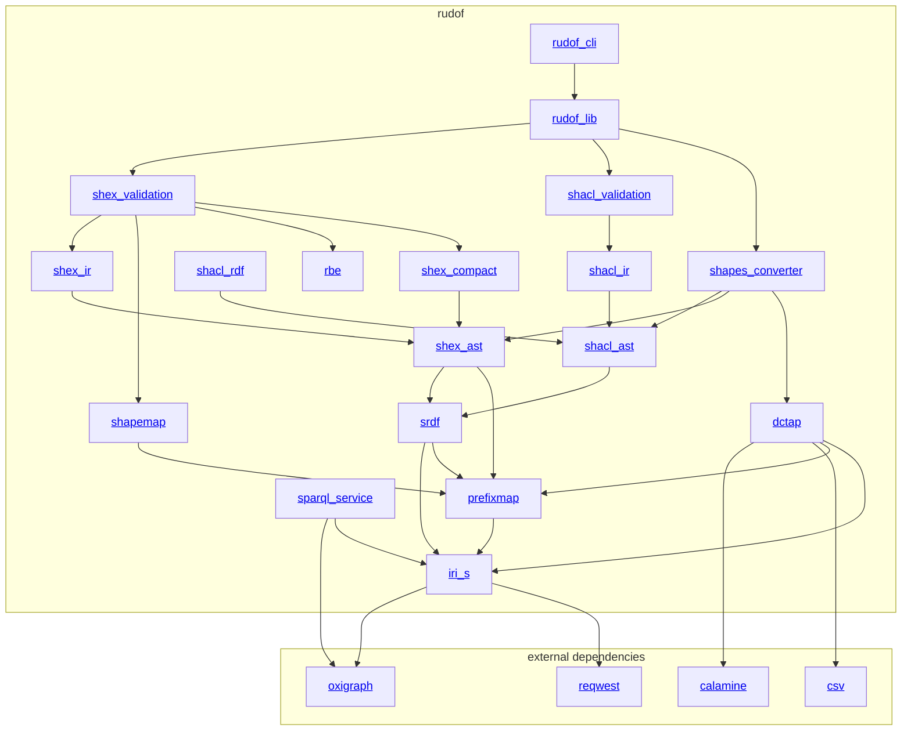

# Architecture

The following diagram presents the main modules (called crates in Rust) and their dependencies:

```mermaid
graph TD;
 iri_s --> oxigraph;
 iri_s --> reqwest ;
 dctap --> calamine ;
 dctap --> csv ;
 sparql_service --> oxigraph ;
subgraph rudof
    rudof_lib[<a href='https://crates.io/crates/rudof_lib'>rudof_lib</a>];
    rudof_cli[<a href='https://crates.io/crates/rudof_cli'>rudof_cli</a>];
    shex_ast[<a href='https://crates.io/crates/shex_ast'>shex_ast</a>];
    srdf[<a href='https://crates.io/crates/srdf'>srdf</a>];
    shex_compact[<a href='https://crates.io/crates/shex_compact'>shex_compact</a>];
    shex_ir[<a href='https://crates.io/crates/shex_ir'>shex_ir</a>];
    shex_validation[<a href='https://crates.io/crates/shex_validation'>shex_validation</a>];
    shacl_validation[<a href='https://crates.io/crates/shacl_validation'>shacl_validation</a>];
    shacl_ast[<a href='https://crates.io/crates/shacl_ast'>shacl_ast</a>];
    shacl_rdf[<a href='https://crates.io/crates/shacl_rdf'>shacl_rdf</a>];
    shacl_ir[<a href='https://crates.io/crates/shacl_ir'>shacl_ir</a>];
    iri_s[<a href='https://crates.io/crates/iri_s'>iri_s</a>];
    prefixmap[<a href='https://crates.io/crates/prefixmap'>prefixmap</a>];
    shapemap[<a href='https://crates.io/crates/shapemap'>shapemap</a>];
    rbe[<a href='https://crates.io/crates/rbe'>rbe</a>];
    shapes_converter[<a href='https://crates.io/crates/shapes_converter'>shapes_converter</a>];
 dctap[<a href='https://crates.io/crates/dctap'>dctap</a>];
 sparql_service[<a href='https://crates.io/crates/sparql_service'>sparql_service</a>];

 rudof_cli --> rudof_lib ;
 shex_ast --> srdf ;
 shex_compact-->shex_ast;
 shex_ir-->shex_ast;
 shex_validation-->shex_ir;
 srdf-->iri_s;
 shacl_ast-->srdf;
 shacl_rdf-->shacl_ast;
 shacl_ir-->shacl_ast;
 shacl_validation-->shacl_ir;
 shex_validation-->shapemap;
 shapemap-->prefixmap;
 shex_ast-->prefixmap;
 srdf-->prefixmap;
 shex_validation-->rbe;
 dctap-->prefixmap;
 dctap --> iri_s;
 shapes_converter-->shacl_ast;
 shapes_converter-->shex_ast;
 shapes_converter-->dctap;
 prefixmap --> iri_s ;
 shex_validation --> shex_compact
 sparql_service --> iri_s ;
 rudof_lib --> shex_validation ;
 rudof_lib --> shacl_validation ;
 rudof_lib --> shapes_converter ;
end
subgraph external dependencies
 oxigraph[<a href='https://crates.io/crates/oxigraph'>oxigraph</a>] ;
 calamine[<a href='https://docs.rs/calamine/latest/calamine/'>calamine</a>] ;
 reqwest[<a href='https://docs.rs/reqwest/latest/reqwest/'>reqwest</a>] ;
 csv[<a href='https://docs.rs/csv/latest/csv/'>csv</a>] 
end
```
