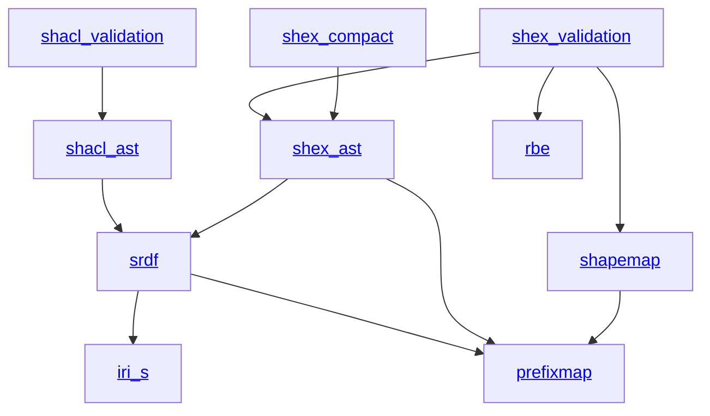

# Architecture

TBD

```mermaid
graph TD;
    shex_ast[<a href='https://crates.io/crates/shex_ast'>shex_ast</a>];
    srdf[<a href='https://crates.io/crates/srdf'>srdf</a>];
    shex_compact[<a href='https://crates.io/crates/shex_compact'>shex_compact</a>];
    shex_validation[<a href='https://crates.io/crates/shex_validation'>shex_validation</a>];
    shacl_validation[<a href='https://crates.io/crates/shacl_validation'>shacl_validation</a>];
    shacl_ast[<a href='https://crates.io/crates/shacl_ast'>shacl_ast</a>];
    iri_s[<a href='https://crates.io/crates/iri_s'>iri_s</a>];
    prefixmap[<a href='https://crates.io/crates/prefixmap'>prefixmap</a>];
    shapemap[<a href='https://crates.io/crates/shapemap'>shapemap</a>];
    rbe[<a href='https://crates.io/crates/rbe'>rbe</a>];
    shex_ast --> srdf ;
    shex_compact-->shex_ast;
    shex_validation-->shex_ast;
    srdf-->iri_s;
    shacl_ast-->srdf;
    shacl_validation-->shacl_ast;
    shex_validation-->shapemap;
    shapemap-->prefixmap;
    shex_ast-->prefixmap;
    srdf-->prefixmap;
    shex_validation-->rbe;
```
