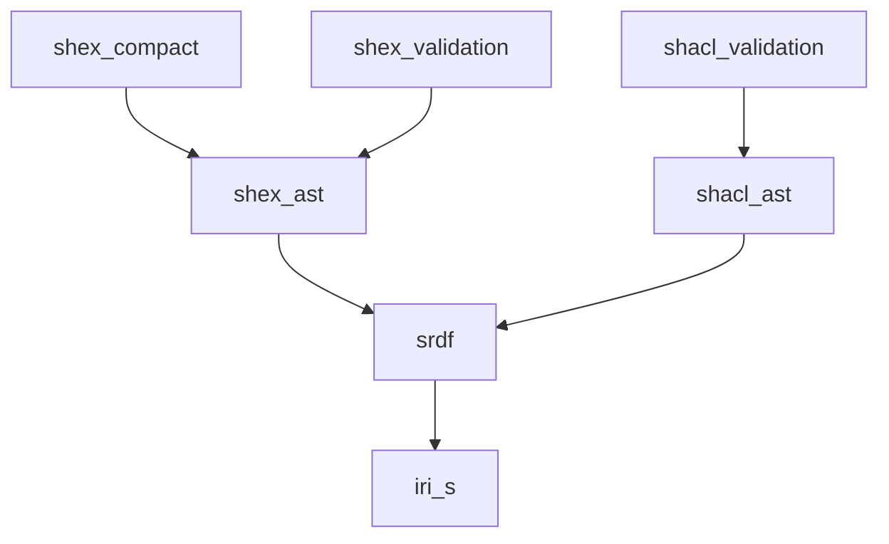

# Architecture

TBD

```mermaid
graph TD;
    shex_ast --> srdf;
    shex_compact-->shex_ast;
    shex_validation-->shex_ast;
    srdf-->iri_s;
    shacl_ast-->srdf;
    shacl_validation-->shacl_ast
```
