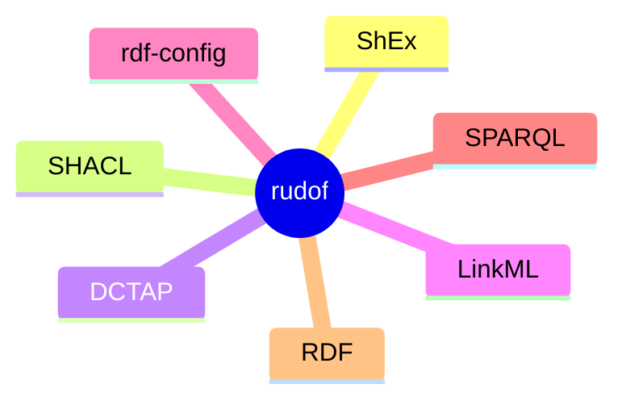

# Scope of the project

The scope of the project is to be a useful tool for people interested in:

- RDF data (which can be obtained from files as well as from SPARQL endpoints)
- RDF data models, shapes or schemas, which can be represented as ShEx, SHACL, DCTap, etc.
- Tasks related with the previous two like:
  - Obtaining information about RDF data
  - Validating RDF data
  - Validating RDF data models
  - Converting between different data, data formats and data models.

## Out of scope

There are some topics which are related with this project and they are currently out of scope like:

- Different types of data, like XML or JSON
- Other types of schemas like XML Schema or JSON Schema
- Ontologies and OWL reasoning
- Rules and inference
- RDF triple stores ([Oxigraph](https://github.com/oxigraph/oxigraph) already gives support for that in Rust)
- ???

In the future, we may reconsider this decision and include support for some of those topics, for example, it would be nice to combine validation and inference, either performing inference on the RDF data before validation, after validation or during the validation.
