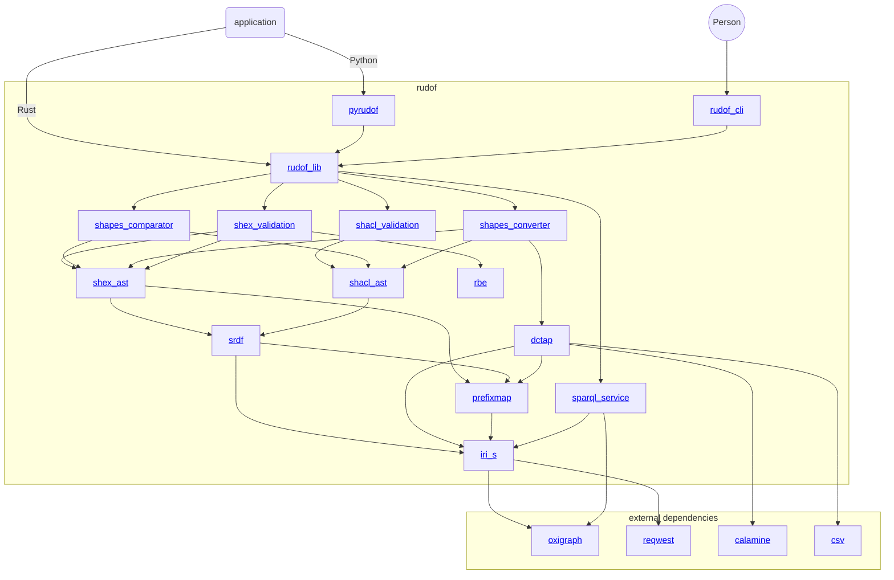

# Overview

`rudof` is a library that implements [Shape Expressions](https://shex.io/), [SHACL](https://www.w3.org/TR/shacl/), [DCTAP](https://www.dublincore.org/specifications/dctap/) and other technologies in the [RDF](https://www.w3.org/RDF/) ecosystem.
The library is implemented in [Rust](https://www.rust-lang.org/) and it also provides [Python bindings](https://pyrudof.readthedocs.io/en/stable/).

`rudof` can be used as a command line tool or can be embedded as a library using [`cargo`](https://crates.io/).
It can be used to validate RDF data represented with different syntaxes like Turtle, NTriples, to name a few.
As well as RDF data available through SPARQL endpoints like Wikidata.
`rudof` can also be used to convert between different RDF data validation technologies (like ShEx, SHACL, or DCTAP), and to generate UML like visualizations and HTML views.

The main contributions of `rudof` are:

- We publish binaries in Linux, Windows and Apple which can be downloaded [here](https://github.com/weso/shex-rs/releases/).
- The source code is available in the [Github repository](https://github.com/rudof-project/rudof).
- A [Paper about `rudof`](assets/pdf/rudof_demo.pdf) was presented at [International Semantic Web Conference](https://iswc2024.semanticweb.org/event/3715c6fc-e2d7-47eb-8c01-5fe4ac589a52/summary) (Baltimore, USA, October 2024) in the Demos and Posters session.
- The [List of issues](https://github.com/rudof-project/rudof/issues).
- The [Discussions](https://github.com/rudof-project/rudof/discussions) page.
- A set of [How-to guides](https://github.com/rudof-project/rudof/wiki/How%E2%80%90to-guides) is also published.
- The collection of [Frequently-Asked-Questions](https://github.com/rudof-project/rudof/wiki/FAQ).

## Modules

`rudof` has been implemented using a modular structure and the different modules are available as Rust crates:

- [ShEx Validation algorithm](https://docs.rs/shex_validation/).
- [ShEx Compact syntax parser](https://docs.rs/shex_compact), a ShEx Compact syntax parser that follows the [ShEx compact grammar](https://shex.io/shex-semantics/index.html#shexc).
- [ShEx AST](https://docs.rs/shex_ast), that represents the [ShEx Abstract syntax](https://shex.io/shex-semantics/index.html#shape-expressions-shexj) based on ShExJ (JSON-LD).
- [SRDF](https://docs.rs/srdf), a Simple RDF Interface in Rust.
- [PrefixMap](https://docs.rs/prefixmap): Turtle based prefixMap representation
- [Conversions between different RDF data modelling technologies](https://docs.rs/shapes_convert).
- [Comparator between shapes](https://docs.rs/shapes_comparator).
- [SHACL AST](https://docs.rs/shacl_ast), that represents the [SHACL core abstract syntax](https://www.w3.org/TR/shacl).
- [SHACL Validation algorithm](https://docs.rs/shacl_validation/).
- [RBE](https://docs.rs/rbe), Regular Bag Expressions.
- [ShEx testsuite](https://docs.rs/shex_testsuite/), the Code in charge of checking the [ShEx testsuite](https://shexspec.github.io/test-suite/).

## Related projects

An incomplete list of projects which are related to `rudof` is the following:

- [ShEx-s](https://www.weso.es/shex-s/), a Scala implementation of ShEx (This project started as a re-implementation of ShEx-s in Rust).
- [SHACL-s](https://www.weso.es/shacl-s/), a Scala implementation of SHACL.
- [ShEx.js](https://github.com/shexjs/shex.js), a Javascript implementation of ShEx.
- [Oxigraph](https://github.com/oxigraph/oxigraph), a SPARQL implementation in Rust that also contains RDF libraries.
- [Nemo](https://github.com/knowsys/nemo), an in-memory rule engine that also contains some `nom` parsers.

## Contributors

- [Jose Emilio Labra Gayo](https://labra.weso.es/)
- [Ángel Iglesias Préstamo](http://angelip2303.github.io/)
- [Diego Martín Fernández](https://github.com/DiegoMfer)
- [Marc-Antoine Arnaud](https://luminvent.com/)
- [Jonas Smedegaard](http://dr.jones.dk/blog/)
- [Full list of contributors](https://github.com/rudof-project/rudof/graphs/contributors)

## Funding and sponsors

The project has been partially funded by some grants or institutions like:

- [WESO - WEb Semantics Oviedo](https://www.weso.es/) is the research group at the [University of Oviedo, Spain](https://www.uniovi.es/) where some of the contributors are participating and has driven the main features implemented by `rudof`.
- [USDA - United States Department of Agriculture](https://www.usda.gov/)
- [Spanish Research Agency](https://www.aei.gob.es/) through the project ANGLIRU - Applying kNowledge Graphs for research Data Interoperability and Reusability (CODE MCI-21-PID2020-117912RB-C21).
- [Database Center for Life Science, Japan](https://dbcls.rois.ac.jp/index-en.html) has provided funding for attending several Biohackathons and RDF Summit events where some of the ideas behind `rudof` materialized as well as the logo.

In case you want to help the project, please contact [Jose E. Labra Gayo](https://labra.weso.es/).

## Supporters and adopters

The following is a list of `rudof` adopters and supporters:

- [WESO (WEb Semantics Oviedo)](http://www.weso.es/). Most of the contributors are part of this research group at the [University of Oviedo](http://www.uniovi.es)
- [USDA - United States Department of Agriculture](https://www.usda.gov/) has been partially funding this project through a Non-Assistance Cooperative Agreement with [WESO](http://www.weso.es/) where `rudof` is used to develop Data Shapes based on the [National Agricultural Library Thesaurus Concept Space](https://lod.nal.usda.gov/en/).
- [Luminvent](https://luminvent.com/) is using `rudof` to validate RDF using Rust code.

If you are using `rudof` and want to be listed, please contact us or add a Pull Request.
